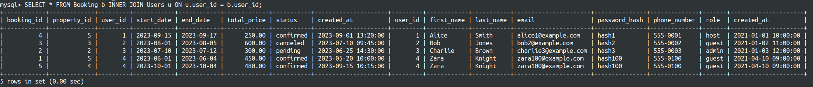
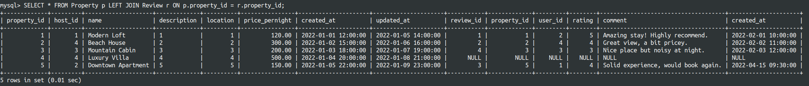
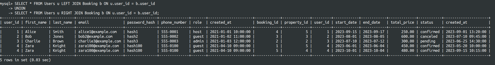
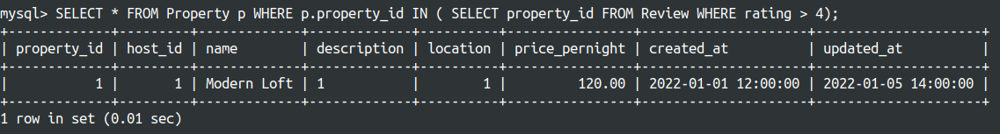
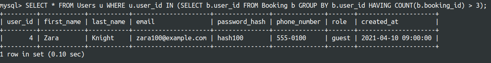
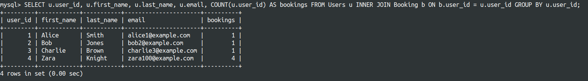
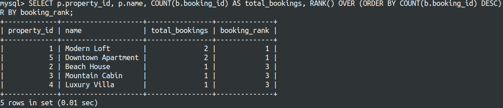

## Write Queries with Joins
Write a query using an `INNER JOIN` to retrieve all bookings and the respective users who made those bookings.

```sql
SELECT * FROM Booking b INNER JOIN Users u 
ON u.user_id = b.user_id;
```



Write a query using a `LEFT JOIN` to retrieve all properties and their reviews, including properties that have no reviews.

```sql
SELECT * FROM Property p LEFT JOIN Review r 
ON p.property_id = r.property_id;
```


Write a query using a `FULL OUTER JOIN` to retrieve all users and all bookings, even if the user has no booking or a booking is not linked to a user.
```sql
SELECT * FROM Users u LEFT JOIN Booking b ON u.user_id = b.user_id
UNION
SELECT * FROM Users u RIGHT JOIN Booking b ON u.user_id = b.user_id;
```


## Subqueries
Write both correlated and non-correlated subqueries.

Write a query to find all properties where the average rating is greater than 4.0 using a subquery.

```sql
SELECT * FROM Property p WHERE p.property_id 
IN ( SELECT property_id FROM Review WHERE rating > 4);
```


Write a correlated subquery to find users who have made more than 3 bookings.
```SQL
SELECT * FROM Users u WHERE u.user_id 
IN (SELECT b.user_id FROM Booking b GROUP BY b.user_id 
    HAVING COUNT(b.booking_id) > 3);
```


## Aggregations and Window Functions
Write a query to find the total number of bookings made by each user, using the `COUNT` function and `GROUP BY` clause.

```SQL
SELECT u.user_id, u.first_name, u.last_name, u.email, COUNT(u.user_id) AS bookings 
FROM Users u 
INNER JOIN Booking b ON b.user_id = u.user_id 
GROUP BY u.user_id;
```



Use a window function `ROW_NUMBER`, `RANK` to rank properties based on the total number of bookings they have received.

```SQL
SELECT 
    p.property_id,
    p.name,
    COUNT(b.booking_id) AS total_bookings,
    RANK() OVER (ORDER BY COUNT(b.booking_id) DESC) AS booking_rank
FROM 
    Property p
LEFT JOIN 
    Booking b ON p.property_id = b.property_id
GROUP BY 
    p.property_id, p.name
ORDER BY 
    booking_rank;
    
```

