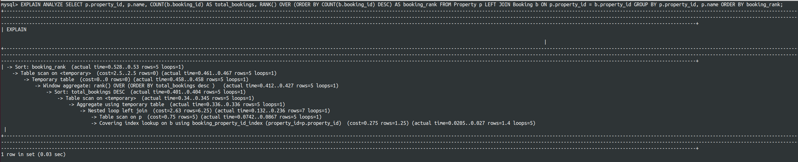

## Implement Indexes for Optimization
Write SQL `CREATE INDEX` commands to create appropriate indexes for those columns and save them on `database_index.sql`

```SQL
ALTER TABLE `Property` ADD INDEX `property_host_id_index` (`host_id`);

ALTER TABLE `Review` ADD INDEX `review_property_id_index` (`property_id`);
ALTER TABLE `Review` ADD INDEX `review_user_id_index` (`user_id`);

ALTER TABLE `Message` ADD INDEX `message_sender_id_index` (`sender_id`);
ALTER TABLE `Message` ADD INDEX `message_recipient_id_index` (`recipient_id`);

ALTER TABLE `Payment` ADD INDEX `payment_booking_id_index` (`booking_id`);
ALTER TABLE `Payment` ADD INDEX `payment_payment_method_index` (`payment_method`);

ALTER TABLE `Booking` ADD INDEX `booking_property_id_index` (`property_id`);
ALTER TABLE `Booking` ADD INDEX `booking_user_id_index` (`user_id`);
```

Measure the query performance before and after adding indexes using EXPLAIN or ANALYZE.
 - The query now runs `0.03s`

