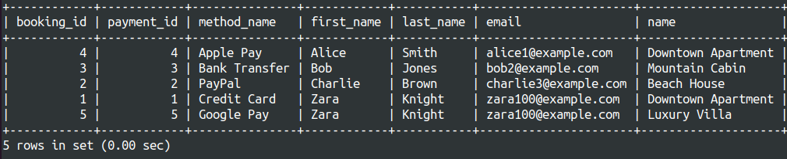
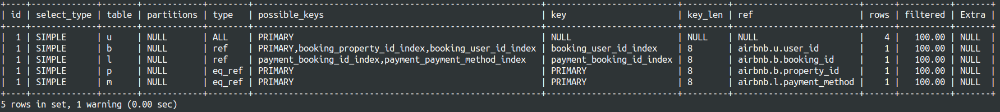

## Optimize Complex Queries
Write an initial query that retrieves all bookings along with the user details, property details, and payment details and save it on `perfomance.sql`

```SQL
SELECT b.booking_id, l.payment_id, 
       m.method_name, u.first_name, 
       u.last_name, u.email, p.name FROM Booking b 
INNER JOIN Users u ON b.user_id = u.user_id 
INNER JOIN Payment l ON l.booking_id = b.booking_id 
INNER JOIN Property p ON p.property_id = b.property_id 
INNER JOIN PaymentMethod m ON m.method_id = l.payment_method;
```


Analyze the query’s performance using `EXPLAIN` and identify any inefficiencies.



Refactor the query to reduce execution time, such as reducing unnecessary joins or using indexing.
  - Only fetch fields that are needed
  - Indexes exist on all foreign key and primary keys

```SQL
SELECT b.booking_id,
       m.method_name, u.first_name, 
       u.last_name, u.email, p.name FROM Booking b 
INNER JOIN Users u ON b.user_id = u.user_id 
INNER JOIN Payment l ON l.booking_id = b.booking_id 
INNER JOIN Property p ON p.property_id = b.property_id 
INNER JOIN PaymentMethod m ON m.method_id = l.payment_method;
```